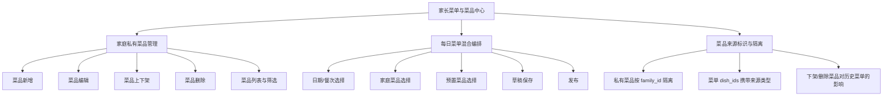
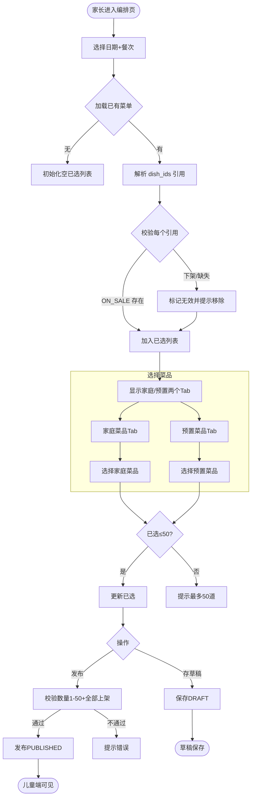
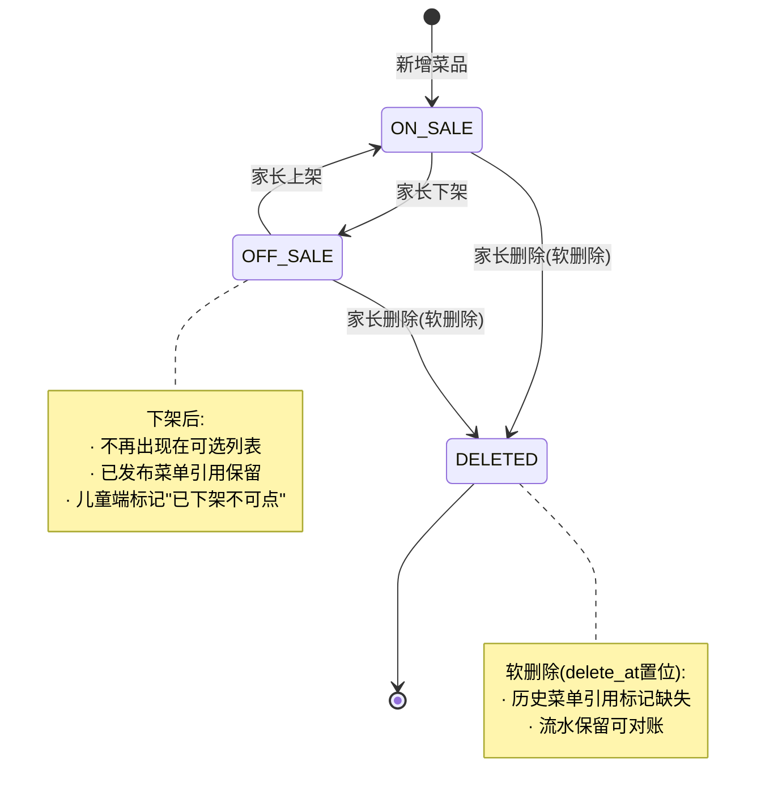

# 成长星球 · 家庭私有菜品录入与菜单编排 需求文档说明书

## 文档信息

| 项目 | 内容 |
|------|------|
| 文档版本 | V1.0 |
| 编写日期 | 2026-09-20 |
| 编写人 | 需求文档专家（PRD Architect） |
| 评审状态 | 待评审 |
| 关联项目 | growth-planet（后端）/ growth-planet-miniapp（小程序） |
| 关联文档 | `2026-09-20-parent-family-menu-editor.md`（家长菜单编辑器已交付） |

## 修订记录

| 版本 | 日期 | 修订人 | 修订内容 |
|------|------|--------|----------|
| V1.0 | 2026-09-20 | PRD Architect | 首版：家庭私有菜品录入 + 菜单混合编排规划 |
| V1.1 | 2026-09-20 | PRD Architect | C-01~C-06 全部按默认建议确认，待确认项转为关键决策 |

---

## 1. 背景介绍

### 1.1 业务背景

成长星球是面向 6-12 岁儿童及家庭的生活成长类应用，其中「家庭菜单」模块允许家长为孩子安排每日早/午/晚餐，儿童在小程序端点单消费虚拟菜品，并接入零花钱钱包扣款体系。

当前菜品来源仅有**平台预置的公共菜品目录**（`life_dish`），家长只能从目录中挑选。实际家庭饮食高度个性化——妈妈做的拿手菜、孩子爱吃的家常菜、家庭自创菜谱均无法录入系统，导致：

- 菜单选择范围受限，无法反映真实家庭饮食
- 家长被迫用「最接近的预置菜」替代真实菜品，菜单数据失真
- 儿童点单的消费数据与实际饮食脱节，钱包扣款体系无法覆盖家庭特色菜

### 1.2 现状分析

**已有能力（本期继承，不改造）：**

| 能力 | 现状 | 说明 |
|------|------|------|
| 公共菜品目录 | `life_dish` 表 | 含分类/图片/虚拟价格/卡路里/标签/过敏原/辣度，状态 ON_SALE/OFF_SALE |
| 菜品分类 | `life_dish_category` 表 | 预置分类（主食/荤菜/素菜/汤/水果等），状态 ENABLED/DISABLED |
| 每日菜单 | `life_menu_daily` 表 | 支持 FAMILY（家庭）/SCHOOL（学校）两种来源；家庭菜单按 `family_id` 归属 |
| 家长菜单编排 | 已交付 | 家长可从预置目录选菜、发布每日菜单（见 parent-family-menu-editor） |
| 钱包/零花钱 | `life_wallet` / `life_allowance_rule` / `life_allowance_log` | 儿童点单扣款、单日/单周额度管控 |
| 菜单归属 | 服务端派生 | family_id/owner_key 由后端从家长鉴权派生，客户端不可传 |

**核心缺口：** 家长无法录入「家庭私有菜品」，每日菜单无法混合「预置菜品 + 私有菜品」。

### 1.3 竞品参考（可选）

本期不涉及，标注「本期不涉及」。

---

## 2. 目的与目标

### 2.1 文档目的

为「家庭私有菜品录入与菜单混合编排」功能提供研发可直接落地的高保真 PRD，明确功能边界、数据模型变更、交互逻辑、异常处理与权限设计。

### 2.2 业务目标（可量化）

| 编号 | 目标 | 指标 |
|------|------|------|
| G-01 | 家庭私有菜品录入能力上线 | 支持家长对 ≤500 条私有菜品的新增/编辑/上下架/删除 |
| G-02 | 菜单混合编排 | 每日菜单可同时包含预置菜品与私有菜品，每餐 1-50 条 |
| G-03 | 数据隔离 | 跨家庭菜品 100% 不可见；同家庭多家长 100% 共享 |
| G-04 | 经济体系打通 | 私有菜品参与钱包扣款，流水可追溯至菜品来源 |
| G-05 | 扩展预留 | 数据模型预留 `visibility` 字段，未来可升级为社区公开菜谱（UGC） |

### 2.3 非目标（明确不做什么）

- **不做** 家长自建菜品分类（本期分类仅从预置 `life_dish_category` 选择）
- **不做** 社区/公开菜谱（UGC）发布、点赞、收藏等社交功能（仅预留字段）
- **不做** 私有菜品图片的云端 AI 识别（如自动识别卡路里/过敏原），图片由家长自行上传
- **不做** 学校侧菜品录入（学校菜单仍由后台运营维护，不在本期家长录入范围）
- **不做** 儿童/学生侧的菜品录入入口（菜品录入仅家长可用）

---

## 3. 目标用户与场景

### 3.1 用户角色定义

| 角色 | 标识 | 能力 | 说明 |
|------|------|------|------|
| 家长 | 已绑定家庭的家庭成员（parent） | 录入/管理私有菜品、编排每日菜单、发布 | 一个家庭可有多位家长（如父母），彼此共享私有菜品 |
| 儿童 | 已绑定家庭的儿童（child） | 查看菜单、点单消费 | 不参与菜品录入 |
| 运营管理员 | 平台后台 | 维护预置菜品目录与分类 | 不介入家庭私有菜品（数据隔离） |

### 3.2 核心使用场景

**场景一：家长录入一道拿手菜**
妈妈想把「番茄炒蛋」录入家庭菜品库。打开小程序「我的菜品」→ 新增 → 填写名称/选分类(素菜)/上传图片/填虚拟价格(8 元)/设辣度(0)/勾选过敏原(蛋)→ 保存。菜品立即进入家庭私有菜品库，同家庭爸爸也可见。

**场景二：编排今日午餐菜单**
爸爸编排今日午餐 → 进入「菜单编排」→ 切换「家庭菜品 / 预置菜品」两个 Tab → 从家庭菜品选「番茄炒蛋」+「红烧排骨」，从预置菜品选「米饭」+「紫菜汤」→ 选满 4 道 → 发布。儿童端即可看到今日午餐。

**场景三：下架一道不再做的菜**
妈妈发现「凉拌黄瓜」孩子不爱吃 → 进入菜品管理 → 将其下架（OFF_SALE）→ 该菜不再出现在菜单可选列表；已发布的旧菜单仍保留引用（标记为不可用，编排时提示清理）。

**场景四：删除一道录错的菜**
爸爸录错了一道菜 → 删除（软删除，delete_at 置位）→ 若该菜已被某日菜单引用，删除前需确认；删除后历史菜单中该引用标记为「缺失」，编排时提示清理。

### 3.3 用户旅程图（文字描述）

```
家长登录小程序
  └─ 进入「我的菜品」（家庭菜品库）
       ├─ 查看列表（按分类/状态/关键词筛选）
       ├─ 新增菜品 → 填写表单 → 保存 → 回到列表
       ├─ 编辑菜品 → 修改 → 保存
       ├─ 上架/下架菜品
       └─ 删除菜品（有引用则二次确认）
  └─ 进入「菜单编排」
       ├─ 选择日期 + 餐次(早/午/晚)
       ├─ 加载当日已有菜单（草稿或已发布）
       ├─ 从「家庭菜品」Tab + 「预置菜品」Tab 混合选择
       ├─ 校验数量(1-50)、重复、可用性
       ├─ 保存草稿 / 发布
       └─ 儿童端可见 → 点单消费 → 钱包扣款
```

---

## 4. 功能需求

### 4.1 功能架构图



### 4.2 功能清单

| 编号 | 模块 | 功能点 | 优先级 | 描述 |
|------|------|--------|--------|------|
| F-01 | 私有菜品管理 | 菜品新增 | P0 | 家长录入一道家庭私有菜品 |
| F-02 | 私有菜品管理 | 菜品列表与筛选 | P0 | 分页查看家庭菜品，按分类/状态/关键词筛选 |
| F-03 | 私有菜品管理 | 菜品编辑 | P0 | 修改已录入菜品（未删除的） |
| F-04 | 私有菜品管理 | 菜品上下架 | P1 | 上架/下架菜品，控制是否可选 |
| F-05 | 私有菜品管理 | 菜品删除 | P1 | 软删除，有引用时二次确认 |
| F-06 | 菜单编排 | 日期/餐次切换 | P0 | 选择要编排的日期与餐次 |
| F-07 | 菜单编排 | 混合选择菜品 | P0 | 同时从家庭菜品 + 预置菜品中选择 |
| F-08 | 菜单编排 | 草稿保存 | P1 | 保存未完成的菜单为 DRAFT |
| F-09 | 菜单编排 | 发布菜单 | P0 | 发布 PUBLISHED 菜单，儿童端可见 |
| F-10 | 菜单编排 | 无效引用清理 | P1 | 下架/删除的菜品在编排时提示清理 |
| F-11 | 儿童侧 | 菜单消费（继承） | P0 | 儿童查看混合菜单并点单（沿用现有流程） |

### 4.3 功能详细说明

#### F-01 菜品新增

- **功能描述**：家长在小程序「我的菜品」页录入一道家庭私有菜品。
- **优先级**：P0
- **输入**：见组件清单（名称、分类、图片、虚拟价格、卡路里、标签、过敏原、过敏原状态、辣度）
- **输出**：新增一条 `life_family_dish` 记录，归属当前家庭，`visibility=PRIVATE`、`status=ON_SALE`、`delete_at=0`
- **业务规则**：
  - 同一家庭内**菜名允许重复**（同一道菜不同家长录入不同版本，不做唯一约束；便于个性化）
  - 跨家庭数据隔离：写入时 `family_id` 由后端从家长鉴权派生，客户端不可传
  - `category_id` 必须引用 `life_dish_category` 中 `status=ENABLED` 的预置分类
  - `image_url` 必填（家长需上传菜品图，便于儿童辨识）；上传复用现有小程序图片上传通道
  - `virtual_price` ≥ 0；参与钱包扣款，建议与家庭实际定价一致
  - `spice_level` 0-3；`allergens` 为 JSON 数组；`allergen_status` 为 UNKNOWN/DECLARED
- **原型描述**：见 §4.4 原型描述-菜品新增页
- **交互逻辑**：
  1. 进入「我的菜品」→ 点击「新增」→ 打开新增页
  2. 填写表单 → 实时校验 → 点击「保存」
  3. 校验通过 → 提交 → 成功后回到列表，新菜置顶并高亮
  4. 校验失败 → 表单项行内提示错误
- **数据要求**：见 §4.4 组件清单校验规则

#### F-02 菜品列表与筛选

- **功能描述**：家长分页查看本家庭私有菜品，支持分类/状态/关键词筛选。
- **优先级**：P0
- **输入**：`page`、`pageSize`、`categoryId`（可选）、`status`（可选，默认仅 ON_SALE）、`keyword`（可选，模糊匹配 name）
- **输出**：菜品列表（含 id、名称、图片、分类、价格、状态、辣度、过敏原摘要）
- **业务规则**：
  - 仅返回当前家庭（`family_id` = 鉴权派生）的菜品
  - 默认排序：`status=ON_SALE` 优先，其次按 `update_time` 倒序
  - 关键词模糊匹配 `name`，大小写不敏感
  - 分页：默认 pageSize=20，上限 100
- **交互逻辑**：进入页面 → 加载第一页 → 下拉触底加载下一页 → 顶部筛选条件变化重新加载

#### F-03 菜品编辑

- **功能描述**：家长修改已录入菜品（未软删除的）。
- **优先级**：P0
- **输入**：`dishId` + 可修改字段（同 F-01 表单，预填原值）
- **输出**：更新 `life_family_dish` 对应记录，`update_time` 刷新
- **业务规则**：
  - 仅本家庭菜品可编辑（鉴权校验 family_id 一致）
  - 已删除（`delete_at<>0`）的菜品不可编辑
  - 编辑不改变 `status`（上下架走 F-04 独立操作），但可修改 `status` 之外的字段
  - 编辑后，引用该菜品的已发布菜单**不自动刷新快照**（菜单存的是菜品 ID 引用，编辑后儿童端展示即生效；如需快照隔离见 §6.5 待确认项）
- **交互逻辑**：列表项点击「编辑」→ 进入编辑页（预填）→ 修改 → 保存 → 回列表

#### F-04 菜品上下架

- **功能描述**：家长将菜品上架（ON_SALE）或下架（OFF_SALE）。
- **优先级**：P1
- **输入**：`dishId`、`targetStatus`（ON_SALE/OFF_SALE）
- **输出**：更新 `status` 字段
- **业务规则**：
  - 下架后菜品不再出现在菜单「可选列表」中
  - **已发布菜单中对该菜的引用保留**（不级联删除），但儿童端展示时该菜标记为「已下架·不可点」
  - 编排页加载已有菜单时，对 OFF_SALE 引用提示「该菜已下架，建议移除」
- **交互逻辑**：列表项 → 「下架」→ 二次确认弹窗 → 确认 → 状态变更 → 列表刷新

#### F-05 菜品删除

- **功能描述**：家长软删除一道菜品（`delete_at` 置位）。
- **优先级**：P1
- **输入**：`dishId`
- **输出**：软删除（`delete_at` 置当前时间戳），记录保留
- **业务规则**：
  - 软删除，不物理删除（保留历史菜单引用可追溯、流水可对账）
  - 若该菜被任意已发布/草稿菜单引用 → 删除前**必须二次确认**，提示「该菜被 N 份菜单引用，删除后这些菜单将标记缺失，确认删除？」
  - 删除后：菜单中对该菜的引用标记为「缺失」，编排页提示清理；儿童端该菜显示「已下架·不可点」
- **交互逻辑**：列表项 → 「删除」→ 后端校验引用数 → 若有引用弹二次确认 → 确认 → 软删除

#### F-06 日期/餐次切换

- **功能描述**：家长选择要编排的日期与餐次（早/午/晚）。
- **优先级**：P0
- **输入**：`menuDate`（YYYY-MM-DD）、`mealType`（BREAKFAST/LUNCH/DINNER）
- **业务规则**：
  - 日期范围：建议允许编排未来 7 天内（含今天）的菜单（具体范围见 §9.1 待确认）
  - 同一家庭 + 同一日期 + 同一餐次，菜单唯一（现有 `uk_source_owner_date_meal` 约束保证）
- **交互逻辑**：进入编排页 → 默认今天 LUNCH → 切换日期/餐次 → 加载该日期餐次已有菜单

#### F-07 混合选择菜品

- **功能描述**：家长从「家庭菜品」+「预置菜品」两个来源混合选择，组成当日餐次菜单。
- **优先级**：P0
- **输入**：选择的菜品引用集合（含来源类型 + 菜品 ID）
- **输出**：维护待发布菜品列表（本地态），最终随 F-09 发布写入 `life_menu_daily.dish_ids`
- **业务规则**：
  - 两个来源分别分页加载，支持各自筛选
  - 已选菜品置灰不可重复选
  - 每餐菜品总数（两来源合计）1-50 条
  - 仅可选择 `status=ON_SALE` 的菜品（家庭菜品 + 预置菜品均需上架）
  - `dish_ids` 结构：对象数组，每项 `{type, id}`，`type` 取值 `PRESET`（预置）/ `FAMILY`（家庭私有）—— **见 §6.5 数据模型变更待确认**
- **交互逻辑**：见 §5 交互逻辑

#### F-08 草稿保存

- **功能描述**：保存未完成的菜单为 DRAFT 状态。
- **优先级**：P1
- **业务规则**：沿用现有 `status=DRAFT`，儿童端不可见；可多次保存覆盖

#### F-09 发布菜单

- **功能描述**：发布 PUBLISHED 菜单，儿童端可见。
- **优先级**：P0
- **业务规则**：
  - 发布前校验：菜品数量 1-50、所有引用菜品仍 ON_SALE、无重复
  - 发布后 `status=PUBLISHED`，`family_id`/`owner_key` 由后端派生（沿用现有）
  - 已发布菜单可再次编辑覆盖发布
- **交互逻辑**：编排页 → 点击「发布」→ 校验 → 成功 → 提示「已发布」→ 儿童端可见

#### F-10 无效引用清理

- **功能描述**：编排页加载已有菜单时，对「已下架/已删除」的菜品引用给出清理提示。
- **优先级**：P1
- **业务规则**：
  - 加载菜单时，对每个引用菜品做存在性 + 上架状态校验
  - 缺失/下架的引用在列表中标记并提示，提供「一键移除无效项」按钮
  - 移除后若菜品数 < 1 则不允许发布，提示至少选 1 道

#### F-11 儿童侧菜单消费（继承）

- **功能描述**：儿童查看混合菜单并点单消费。
- **优先级**：P0
- **业务规则**：
  - 继承现有儿童点单流程，**不改造交互**
  - 展示时需根据 `dish_ids` 中的 `{type, id}` 解析菜品：`PRESET` 查 `life_dish`、`FAMILY` 查 `life_family_dish`
  - 私有菜品参与钱包扣款（`virtual_price` 计入 `life_allowance_log` 流水）
  - 儿童侧不区分菜品来源标签（对儿童透明，统一展示为菜品）

### 4.4 原型描述

#### 原型描述-菜品新增/编辑页

```
┌─────────────────────────────────────┐
│  ← 我的菜品 / 新增菜品               │  导航栏
├─────────────────────────────────────┤
│  ┌───────────┐                       │
│  │  [图片]   │  点击上传/拍照          │  图片区（必填）
│  └───────────┘                       │
├─────────────────────────────────────┤
│  菜品名称  [____________________]   │  必填，≤64字
│  分类      [选择分类 ▾]              │  必填，引用预置分类
│  虚拟价格  [_______] 元              │  必填，≥0
│  卡路里    [_______] kcal（选填）    │  选填，≥0
│  辣度      ○不辣 ○微辣 ○中辣 ○重辣  │  必选，0-3
│  标签      [____] [+添加]            │  选填，逗号分隔
│  过敏原    □蛋 □奶 □海鲜 □坚果 ...   │  多选，JSON数组
├─────────────────────────────────────┤
│            [  保存  ]                │  操作栏
└─────────────────────────────────────┘
```

**组件清单：**

| 组件 | 类型 | 必填 | 校验规则 | 默认值 | 说明 |
|------|------|------|----------|--------|------|
| 图片 | 上传 | 是 | jpg/png ≤2MB | 无 | 复用小程序上传通道 |
| 菜品名称 | 文本输入 | 是 | 1-64 字 | 空 | 同家庭允许重名 |
| 分类 | 下拉选择 | 是 | 取自 life_dish_category(status=ENABLED) | 空 | 不可自建 |
| 虚拟价格 | 数字输入 | 是 | ≥0，≤9999.99 | 0 | 参与钱包扣款 |
| 卡路里 | 数字输入 | 否 | ≥0 | 空 | 选填 |
| 辣度 | 单选 | 是 | 0-3 | 0 | 0不辣/1微/2中/3重 |
| 标签 | 标签输入 | 否 | 每项 ≤16 字，≤5 项 | 空 | 逗号或回车分隔 |
| 过敏原 | 多选 | 否 | 预置过敏原字典 | 空[] | 选填，影响过敏原状态 |

**空/加载/错误态：**
- 加载态：保存时按钮 loading 禁用
- 错误态：表单项行内红字提示

#### 原型描述-菜单编排页（家长模式）

```
┌─────────────────────────────────────┐
│  ← 菜单编排                          │
│  日期 [2026-09-20 ▾]  餐次 [午餐 ▾]  │
├─────────────────────────────────────┤
│  [家庭菜品] [预置菜品]    已选 4/50   │  来源 Tab + 计数
├─────────────────────────────────────┤
│  分类 [全部 ▾]  搜索 [______]        │  筛选栏
│  ┌──────────────────────────────┐   │
│  │ ☑ 番茄炒蛋   ¥8   素菜/不辣  │   │  菜品卡片(已选)
│  │ ☐ 红烧排骨   ¥18  荤菜/微辣  │   │  菜品卡片(未选)
│  │ ⚠ 凉拌黄瓜  已下架 [移除]    │   │  无效引用提示
│  └──────────────────────────────┘   │
│  （下拉加载更多）                    │
├─────────────────────────────────────┤
│  已选菜品：番茄炒蛋、红烧排骨、米饭…  │  已选摘要
│  [存草稿]            [发布]          │  操作栏
└─────────────────────────────────────┘
```

**交互行为：**

| 触发 | 动作 | 反馈 | 跳转/弹窗 |
|------|------|------|-----------|
| 切换 Tab | 加载对应来源菜品 | 列表刷新 | 无 |
| 点击未选菜品 | 加入已选 | 计数+1，卡片变选中态 | 无 |
| 点击已选菜品 | 移出已选 | 计数-1，卡片恢复 | 无 |
| 计数达 50 | 再点菜品 | Toast「每餐最多 50 道」 | 无 |
| 点击「移除」(无效项) | 移出无效引用 | 列表刷新，计数-1 | 无 |
| 点击「存草稿」 | 保存 DRAFT | Toast「已存草稿」 | 无 |
| 点击「发布」 | 校验+发布 | 成功 Toast / 失败提示 | 无 |

---

## 5. 交互逻辑

### 5.1 核心流程图



### 5.2 状态流转图（菜品生命周期）



### 5.3 页面跳转逻辑

| 当前页面 | 触发动作 | 目标页面 | 传参 | 备注 |
|----------|----------|----------|------|------|
| 我的菜品列表 | 点击「新增」 | 菜品新增页 | 无 | |
| 我的菜品列表 | 点击「编辑」 | 菜品编辑页 | dishId | |
| 我的菜品列表 | 点击「下架/上架」 | 原页(刷新) | dishId, status | 二次确认 |
| 我的菜品列表 | 点击「删除」 | 原页(刷新) | dishId | 有引用二次确认 |
| 首页/菜单页 | 进入「菜单编排」 | 菜单编排页 | 无 | 默认今天LUNCH |
| 菜单编排页 | 切换日期/餐次 | 原页(重载) | date, meal | |
| 菜单编排页 | 点击「发布」 | 原页(提示) | menuDate, mealType, dishIds | |

### 5.4 交互细节说明

- **多家长并发编辑同一菜单**：同一家庭父母同时编排今日午餐。现有 `life_menu_daily` 唯一键约束保证同一家庭+日期+餐次只有一条记录，后端采用「最后写入覆盖」+ 乐观锁 `version` 字段（见 §6.5 待确认是否新增 version 列）。本期建议：发布时若检测到记录已被他人更新，提示「菜单已被他人修改，请刷新后重试」。
- **菜品编辑对已发布菜单的影响**：菜单存菜品 ID 引用，非快照。家长编辑菜品（如改价格）后，已发布菜单中该菜展示/计价即时生效。如需快照隔离（发布时冻结价格），见 §6.5 待确认项。

---

## 6. 异常处理

### 6.1 异常处理矩阵

| 编号 | 异常场景 | 触发条件 | 处理方式 | 用户提示 | 日志记录 |
|------|----------|----------|----------|----------|----------|
| E-01 | 菜品新增字段校验失败 | 名称空/价格负/分类未选等 | 阻断提交 | 表单项行内提示 | WARN |
| E-02 | 菜品新增跨家庭写入 | 客户端传 family_id | 后端忽略客户端值，用鉴权派生 | 无（静默纠正） | WARN |
| E-03 | 菜品图片上传失败 | 网络/大小超限 | 阻断保存 | Toast「图片上传失败」 | ERROR |
| E-04 | 编辑/删除他人家庭菜品 | family_id 不匹配 | 返回业务错误 | Toast「无权操作该菜品」 | WARN |
| E-05 | 删除有引用的菜品未确认 | 未通过二次确认 | 阻断删除 | 弹窗要求确认 | INFO |
| E-06 | 菜单发布数量超限 | dish_ids > 50 | 阻断发布 | Toast「每餐最多 50 道」 | WARN |
| E-07 | 菜单发布数量不足 | dish_ids < 1 | 阻断发布 | Toast「至少选择 1 道」 | WARN |
| E-08 | 菜单发布含下架/缺失菜品 | 引用菜品 OFF_SALE/DELETED | 阻断发布 | Toast「N 道菜已下架，请移除」 | WARN |
| E-09 | 菜单发布并发冲突 | 他人已更新同记录 | 阻断并提示刷新 | Toast「菜单已被修改，请刷新」 | WARN |
| E-10 | 私有菜品点单扣款失败 | 钱包余额不足/超额度 | 沿用现有钱包错误处理 | 沿用现有提示 | 沿用 |

### 6.2 网络异常处理

- 所有接口失败统一 Toast 提示「网络异常，请稍后重试」
- 列表加载失败展示错误态，提供「重新加载」按钮
- 表单提交失败保留用户已填内容，不清空

### 6.3 数据异常处理

- 菜单 `dish_ids` 解析时对非法项（非对象/缺 type/缺 id）做容错：跳过非法项并 WARN 日志
- 菜品 ID 在对应表中查不到（被物理删除的极端情况）：标记为「缺失」，不阻断菜单展示

### 6.4 权限异常处理

- 未登录/家长未绑定家庭：跳转登录/绑定流程
- 越权操作他人家庭菜品/菜单：返回业务错误码，Toast「无权操作」

### 6.5 并发与一致性处理（含数据模型变更待确认项）

**关键变更点：`life_menu_daily.dish_ids` 结构扩展**

现有 `dish_ids` 为纯 ID 数组（`JSON_TYPE='ARRAY'`），无法区分菜品来源（预置 vs 家庭私有）。本期需扩展为**对象数组**：

```json
// 变更前（现有，仅预置菜品）
[1, 2, 3]

// 变更后（混合来源）
[
  {"type": "PRESET", "id": 1},
  {"type": "FAMILY", "id": 101},
  {"type": "PRESET", "id": 2}
]
```

**关键决策 C-01（数据迁移方案）— 已确认：方案 A**
- `dish_ids` 改为对象数组，历史数据一次性迁移（所有旧 ID 默认补 `{type:"PRESET", id:旧值}`），修改 `chk_menu_dishes` 约束为校验对象数组。优点：来源清晰、可追溯；代价：需迁移 + 改约束 + 改读写逻辑。详见变更文档。

**关键决策 C-02（菜单快照）— 已确认：不快照**
- 菜品编辑即时影响已发布菜单（如改价后儿童点单按新价扣款），与现有预置菜品行为一致。不做 `{type, id, name, price, image_url}` 快照。

**关键决策 C-03（乐观锁）— 已确认：新增 version 列**
- 给 `life_menu_daily` 新增 `version INT NOT NULL DEFAULT 0` 支持乐观锁，用于并发冲突提示（E-09）。详见变更文档。

---

## 7. 日志与埋点

### 7.1 操作日志

| 日志类型 | 记录字段 | 触发时机 | 存储周期 |
|----------|----------|----------|----------|
| 私有菜品新增 | operatorId, familyId, dishId, name, price | 新增成功 | 180 天 |
| 私有菜品编辑 | operatorId, familyId, dishId, 变更字段(前后值) | 编辑成功 | 180 天 |
| 私有菜品上下架 | operatorId, familyId, dishId, oldStatus, newStatus | 状态变更 | 180 天 |
| 私有菜品删除 | operatorId, familyId, dishId, 引用菜单数 | 软删除 | 180 天 |
| 菜单发布 | operatorId, familyId, menuDate, mealType, dishIds, dishCount | 发布成功 | 180 天 |

### 7.2 行为埋点

| 事件名 | 触发时机 | 采集参数 | 分析用途 |
|--------|----------|----------|----------|
| dish_add_click | 点击新增菜品 | familyId | 录入意愿 |
| dish_add_submit | 提交新增 | fieldCount, hasImage, hasAllergen | 录入完整度 |
| menu_edit_enter | 进入编排页 | menuDate, mealType | 编排活跃度 |
| menu_dish_pick | 选择一道菜 | dishType(PRESET/FAMILY), dishId | 来源偏好 |
| menu_publish | 发布菜单 | dishCount, familyDishCount, presetDishCount | 混合使用度 |

### 7.3 系统日志

- 所有 WARN/ERROR 级别异常（§6.1）写入系统日志，含 traceId 便于排查
- 数据迁移脚本执行单独记录日志（迁移条数、耗时、失败条数）

---

## 8. 权限设计

### 8.1 角色定义

| 角色 | 描述 | 典型用户 |
|------|------|----------|
| 家长 | 已绑定家庭的家庭成员，可录入/管理私有菜品、编排菜单 | 父亲、母亲 |
| 儿童 | 已绑定家庭的儿童，仅消费菜单 | 6-12 岁孩子 |
| 运营管理员 | 平台后台，维护预置菜品目录与分类 | 平台运营 |

### 8.2 权限矩阵

| 功能/角色 | 家长 | 儿童 | 运营管理员 |
|-----------|------|------|-----------|
| 私有菜品-新增 | ✅ 可操作 | ❌ | ❌（不在本期家长入口） |
| 私有菜品-查看列表 | ✅ 仅本家庭 | ❌ | ✅ 后台可查（脱敏） |
| 私有菜品-编辑 | ✅ 仅本家庭 | ❌ | ❌ |
| 私有菜品-上下架 | ✅ 仅本家庭 | ❌ | ❌ |
| 私有菜品-删除 | ✅ 仅本家庭 | ❌ | ❌ |
| 预置菜品-查看 | ✅ | ✅ | ✅ |
| 预置菜品-维护 | ❌ | ❌ | ✅ |
| 菜单-编排/发布 | ✅ 仅本家庭 | ❌ | ❌ |
| 菜单-查看(已发布) | ✅ 本家庭 | ✅ 本家庭 | ✅ |
| 菜单-点单消费 | ❌ | ✅ 本家庭 | ❌ |

### 8.3 数据权限规则

- 私有菜品：`family_id = 当前家长所属家庭`，跨家庭 100% 不可见
- 菜单：`family_id = 当前家庭`，仅本家庭家长可编排、本家庭儿童可消费
- 所有 `family_id`/`owner_key`/`source_type`/`visibility` 字段**严禁由客户端传入**，一律后端从家长鉴权派生（沿用现有安全约束）

### 8.4 权限变更流程

本期不涉及，标注「本期不涉及」（沿用现有家长鉴权体系）。

---

## 9. 非功能需求

### 9.1 性能要求

| 指标 | 要求 |
|------|------|
| 私有菜品列表查询 | P95 ≤ 300ms（分页 pageSize=20） |
| 菜品新增/编辑 | P95 ≤ 500ms（含图片上传） |
| 菜单编排页加载 | P95 ≤ 500ms（含两来源首屏） |
| 菜单发布 | P95 ≤ 300ms |
| 单家庭私有菜品量 | 支持 ≤ 500 条 |
| 可编排日期范围 | 待确认：默认未来 7 天（含今天），可配置 |

### 9.2 兼容性要求

- 小程序端：微信基础库 ≥ 2.10，沿用现有 Babel 编译方案
- 后端：Spring Boot 2.7.18 + MyBatis-Plus，沿用现有风格
- 数据库：MySQL，沿用 `create_time`/`update_time`/`delete_at` 软删除约定

### 9.3 安全要求

- 严禁客户端传 `familyId`/`ownerKey`/`sourceType`/`visibility`（后端派生）
- 越权访问返回统一业务错误码，不暴露数据是否存在
- 图片上传校验类型与大小，防恶意文件
- 私有菜品内容不进入公共索引，跨家庭搜索不可命中

### 9.4 可用性要求

- 数据模型变更（dish_ids 结构迁移）需可回滚，迁移脚本幂等
- 灰度期间新旧结构兼容读取（见 §10.2）

---

## 10. 上线计划

### 10.1 阶段划分

| 阶段 | 内容 | 依赖 |
|------|------|------|
| S1 | 数据模型变更（life_family_dish 新表 + dish_ids 结构迁移） | C-01/C-03 方案确认 |
| S2 | 后端：私有菜品 CRUD + 上下架 + 列表筛选接口 | S1 |
| S3 | 后端：菜单混合编排接口（读写对象数组 dish_ids）+ 无效引用校验 | S1 |
| S4 | 小程序：菜品管理页（新增/编辑/列表/上下架/删除） | S2 |
| S5 | 小程序：菜单编排页扩展（双 Tab 混合选择 + 无效清理） | S3 |
| S6 | 联调 + 集成测试 + 灰度 | S4,S5 |

### 10.2 灰度策略

- 数据迁移在低峰期执行，脚本幂等可重跑
- 后端先兼容新旧 `dish_ids` 结构读取（纯 ID 数组视为全 PRESET），灰度期双写
- 小程序按家庭白名单灰度开放「我的菜品」入口

### 10.3 回滚方案

- `life_family_dish` 为新表，回滚仅删除该表 + 撤销菜单中对 FAMILY 引用的菜品项即可
- `dish_ids` 结构若选方案 A：回滚需将对象数组还原为纯 ID 数组（仅保留 PRESET 项）；建议保留迁移脚本的反向脚本
- 回滚顺序：先关小程序入口 → 后端切回旧读写逻辑 → 执行数据反向迁移 → 删除新表

---

## 附录

### A. 术语表

| 术语 | 含义 |
|------|------|
| 预置菜品 (PRESET) | 平台维护的公共菜品目录，存于 `life_dish`，所有家庭可见 |
| 家庭私有菜品 (FAMILY) | 家长录入的私有菜品，存于 `life_family_dish`，按 `family_id` 隔离 |
| visibility | 菜品可见性，本期固定 PRIVATE，预留 PUBLIC（社区公开 UGC） |
| dish_ids | `life_menu_daily` 中存储菜品引用的 JSON 字段，本期扩展为对象数组 `{type, id}` |
| 钱包扣款 | 儿童点单消费虚拟菜品，从 `life_wallet` 扣除 `virtual_price`，记入 `life_allowance_log` |

### B. 关联文档

- `2026-09-20-parent-family-menu-editor.md`：家长菜单编辑器（已交付的预置菜品选菜能力）
- `growth-planet/sql/sprint3_catalog.sql`：现有菜品/分类/菜单表 DDL
- `growth-planet/sql/sprint2_schema.sql`：钱包/零花钱体系 DDL
- `growth-planet/docs/sprint3-catalog.md`：现有菜品/菜单接口契约

### C. 关键决策（已确认，2026-09-20 按默认建议）

| 编号 | 决策问题 | 影响范围 | 最终决策 |
|------|----------|----------|----------|
| C-01 | `dish_ids` 结构迁移方案 | 数据模型、读写逻辑 | **方案 A**：改对象数组，历史数据一次性迁移 |
| C-02 | 菜单是否冻结价格快照 | 儿童端计价一致性 | **不快照**：编辑即时生效（与预置一致） |
| C-03 | `life_menu_daily` 乐观锁列 | 并发冲突处理 | **新增 version 列** |
| C-04 | 可编排日期范围 | 编排入口约束 | **未来 7 天（含今天）**，可配置 |
| C-05 | 同家庭菜名是否允许重复 | 数据唯一性 | **允许重复**（个性化） |
| C-06 | 菜品图片上传通道 | 实现成本 | **沿用现有小程序上传通道** |

---

## PRD 自检清单

- [x] 每个功能点（F-01~F-11）有明确输入输出
- [x] 交互逻辑覆盖所有操作路径（新增/编辑/上下架/删除/编排/发布）
- [x] 异常处理覆盖网络/数据/权限/并发场景（E-01~E-10）
- [x] 权限矩阵覆盖家长/儿童/运营三角色
- [x] 日志埋点覆盖关键操作（操作日志 + 行为埋点）
- [x] 6 个待确认项已汇总（C-01~C-06）
- [x] 数据模型变更影响已标注，编码前需出变更文档
- [x] 非目标已明确（不做自建分类/UGC/儿童录入/学校录入）

> **下一步**：C-01~C-06 已全部确认。进入「数据模型变更文档 + 接口设计」阶段——见 `2026-09-20-family-private-dish-ddl-change.md`，确认后再编码。
